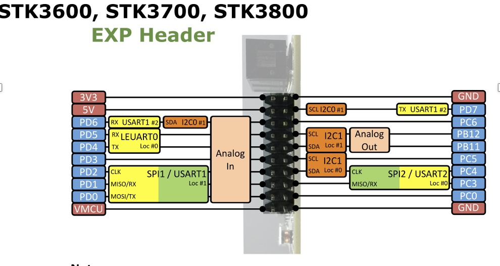

# Assignment 32: SPI Loopback Test

## Overview

This assignment tests your ability to configure and use the **SPI (Serial Peripheral Interface)** on the EFM32GG MCU. You will implement a simple **loopback test** where data sent on the MOSI line is expected to be received on the MISO line, validating that the SPI interface is working correctly.

## SPI Loopback Concept

In a typical SPI system:
- **MOSI** (Master Out, Slave In): carries data from master to slave
- **MISO** (Master In, Slave Out): carries data from slave to master
- **CLK** (Clock): synchronizes the transfer
- **CS** (Chip Select): selects the slave device

In this **loopback configuration**, MOSI and MISO are connected together (externally or internally), so whatever the master sends out on MOSI comes back on MISO. This allows you to verify that the SPI hardware is configured correctly without needing a separate slave device.

## Hardware Configuration

### Hardware Setup — Loopback Connection
**Important:** This assignment requires a **hardware loopback connection** to test SPI communication. You must connect the MOSI and MISO pins together using a female-to-female wire:
- Connect **PD0 (MOSI)** to **PD1 (MISO)** with a jumper wire.

This creates an internal loopback where transmitted data on MOSI is immediately received on MISO, allowing you to verify that the SPI interface is working correctly. Without this connection, the receive buffer will remain empty and your code will hang waiting for data.

### EXP Header Pinout Reference
The STK3600/3700/3800 boards use a common EXP (expansion) header. The USART1 SPI pins are located on the left side:



**ASCII Pinout Diagram (Left Edge):**
```
STK EXP Header (Left Side):
┌─────────────────┐
│ 3V3             │  (Power)
│ 5V              │
│ GND             │
│ PD6             │
│ PD5             │
│ PD4             │
│ PD3  ← CS       │  << Chip Select (optional for loopback)
│ PD2  ← CLK      │  << Clock output
│ PD1  ← MISO     │  << Connect to PD0 with a wire
│ PD0  ← MOSI     │  << Connect to PD1 with a wire
│ VMCU            │
└─────────────────┘
```

**To create the loopback:**
1. Locate the EXP header on your board (right-angle connectors on the side).
2. Find **PD0** and **PD1** on the left edge (bottom pins).
3. Connect them together with a female-to-female jumper wire.
4. This allows data transmitted on MOSI (PD0) to loop back immediately on MISO (PD1).

### GPIO Pins (Port D)
- **PD0**: MOSI (push-pull output)
- **PD1**: MISO (input)
- **PD2**: CLK (push-pull output)
- **PD3**: CS (push-pull output)

All pins are routed through **Route #1** of USART1.

### SPI Parameters
- **Bit Order**: MSB first
- **Clock Speed**: 1 MHz
- **SPI Mode**: Mode 3 (CPOL=1, CPHA=1)
  - CPOL=1: clock is idle high
  - CPHA=1: data is sampled on the second clock edge
- **Master Mode**: enabled
- **Loopback Source**: USART1

## Implementation Tasks

### 1. Implement `app_init()`

This function must:

1. **Enable clocks** for:
   - `cmuClock_HFPER` (high-frequency peripheral clock)
   - `cmuClock_GPIO` (GPIO clock)
   - `cmuClock_USART1` (USART1 clock)

2. **Configure GPIO pins** (PD0, PD1, PD2, PD3) using `GPIO_PinModeSet()`:
   - MOSI (PD0): push-pull output
   - MISO (PD1): input (no pull)
   - CLK (PD2): push-pull output
   - CS (PD3): push-pull output

3. **Configure USART1 for SPI mode**:
   - Use `USART_InitSync()` to set up the frame format (8 bits, no parity, 1 stop bit)
   - Set the `SYNC` bit in the control register
   - Set MSB first bit order
   - Configure the clock divisor to achieve 1 MHz baud rate
   - Enable SPI Mode 3 (CPOL and CPHA bits)
   - Set to master mode via the `CMD` register
   - Enable both transmit and receive

4. **Configure routing**:
   - The code skeleton already shows how to set the `ROUTE` register for Route #1
   - Enable clock, TXPEN, and RXPEN pins (code provided)

### 2. Implement `SPI_Transfer(uint8_t data)`

This function sends one byte of data and returns the byte received during that transaction:

1. **Wait for TX buffer space**: Poll `USART_STATUS_TXBL` bit until it's set
2. **Write data to TX buffer**: Write to `usart->TXDATA`
3. **Wait for transaction complete**: Poll `USART_STATUS_TXC` bit until it's set
4. **Read data from RX buffer**: Read from `usart->RXDATA`
5. **Return the received byte**

### 3. Expected Behavior in `app_process_action()`

The main loop (already implemented) does the following:

1. Sends the byte `0x76` via SPI loopback
2. Receives the echoed byte
3. Compares sent vs. received:
   - **If they match**: success! The loop exits and you're done
   - **If they don't match**: the loop continues forever (failure case)

## Implementation Tips

### Clock Configuration
Use `CMU_ClockEnable()` with the clock enum values. Example:
```cpp
CMU_ClockEnable(cmuClock_HFPER, true);
```

### GPIO Configuration
Use `GPIO_PinModeSet()` from `em_gpio.h`. The signature is:
```cpp
void GPIO_PinModeSet(GPIO_Port_TypeDef port, uint32_t pin, 
                     GPIO_Mode_TypeDef mode, uint32_t out);
```

Example:
```cpp
GPIO_PinModeSet(gpioPortD, 0, gpioModePushPull, 1);  // PD0 as push-pull output
```

### USART SPI Configuration
Key register fields (not an exhaustive list):
- `USART_CTRL_SYNC`: enables synchronous (SPI) mode
- `USART_CTRL_MSBF`: sets MSB-first bit order
- `USART_CTRL_CPOL` and `USART_CTRL_CPHA`: SPI mode bits
- `USART_CMD_MASTEREN`: enables master mode
- `USART_CMD_TXEN` and `USART_CMD_RXEN`: enable transmit and receive
- `USART_STATUS_TXBL`: TX buffer level flag
- `USART_STATUS_TXC`: TX complete flag

Refer to the EFM32GG reference manual for exact bit positions and register names.

### Clock Divisor Calculation
The clock divisor determines the SPI bit rate:
```
Bit Rate = HFPER Clock / (2 × (1 + CLKDIV))
```
For 1 MHz with a 14 MHz HFPER clock: CLKDIV = 0x280

## Testing

When you build and run this application:

1. The `app_process_action()` function is called repeatedly
2. Each call sends `0x76` via SPI loopback
3. If loopback is working, the byte should return unchanged
4. Once success is detected, the program exits the main loop

**Success**: Program completes and enters the "done" loop (no output expected, just halts normally)  
**Failure**: Program never escapes the process loop (appears stuck)

## Reference

- **EFM32GG Device Reference Manual**: Sections on USART in synchronous mode
- **Gecko SDK emlib**: `em_usart.h`, `em_gpio.h`, `em_cmu.h`
- **SPI Standard**: Review CPOL/CPHA combinations if unfamiliar with SPI modes