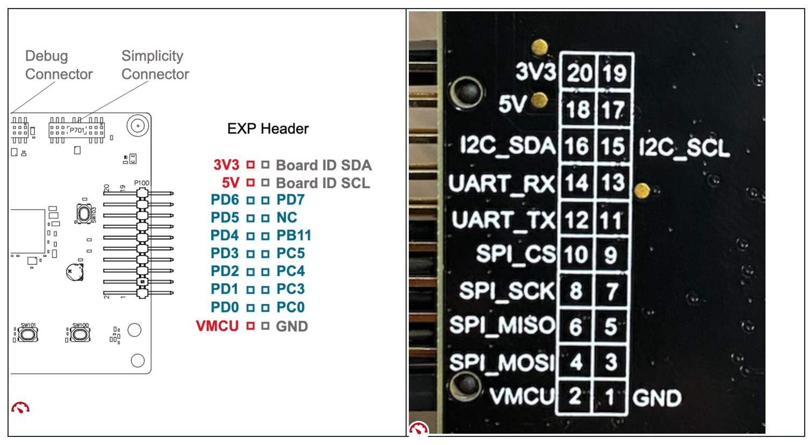
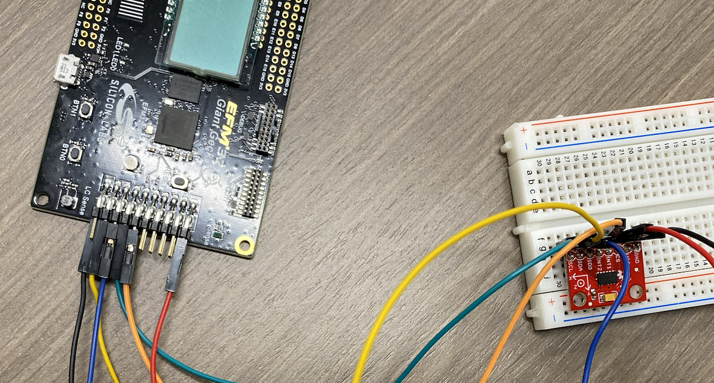

**Assignment 3.3a - SPI Read and Write Register**

In this assignment you will build upon the SPI Loopback assignment to perform Read and Write Register operations for the ADXL345

**Step #1: Wire up the ADXL345**
To operate, the ADXL345 needs to connect to the SPI Interface (MISO, MOSI, SCLK, and CS) and a power Supply (3.3V and Ground). We will use the Expansion headers on the right-angle connectors that extend off the side of the board.

Looking at the pins directly, and reading left to right, the top row of pins are even: 2, 4, 6,... and the bottom row are odd 1, 3, 5, ...

To connect the Giant Gecko to the ADXL345, use M/F wires and establish the following connections. 

| Pin Number | Pin Name | Functionality | ADXL Pin Name |
|------------|----------|----------------|---------------|
| 4 | PD0 | SPI_MOSI | SDA |
| 6 | PD1 | SPI_MISO | SDO |
| 8 | PD2 | SPI_SCLK | SCL |
| 10 | PD3 | SPI_CS | CS |
| 20 | 3.3V | VCC | VCC |
| 1 | GND | GND | GND |

**Note: Only connect to the 3.3V Pin. The ADXL cannot handle 5V. Also, the GND pin is on the opposite row and side of the board from the 3.3V pin.**

When completed, the wiring should appear as below:

**Task #2: Complete setup_SPI(), setup_gpio_pins(), and SPI_Transfer()**
Copy the code you developed in SPI Loopback into the these functions to complete these methods. The code should copy/pasted between the two solutions and will not require significant modification.

**Task #3: Complete ReadRegister()**

Complete the readRegister() function in app.c. This function utilizes the SPI_Transfer() function to perform a READ from the ADXL345 as described in the lecture notes.

Once complete, run the program and set a break point after Task1 is run in app_process_action(). This will attempt to read from register 0x0 on the ADXL345, which should result in the value of 0xE5. If 0xE5 is not received, then read was not implemented correctly.

**Task #4: Complete writeRegister()**

Complete the writeRegister() function in app.c. This function utilizes the SPI_Transfer() function to perform a WRITE to the ADXL345 as described in the lecture notes.

Once complete, run the program and set a break point after Task2 is run in app_process_action(). This will attempt to write the value 0x1F to the TAP_THRESH register (address 0x1D) and then read the value back. If the value returned is the same as the one written, then writeRegister() is functional.
