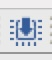
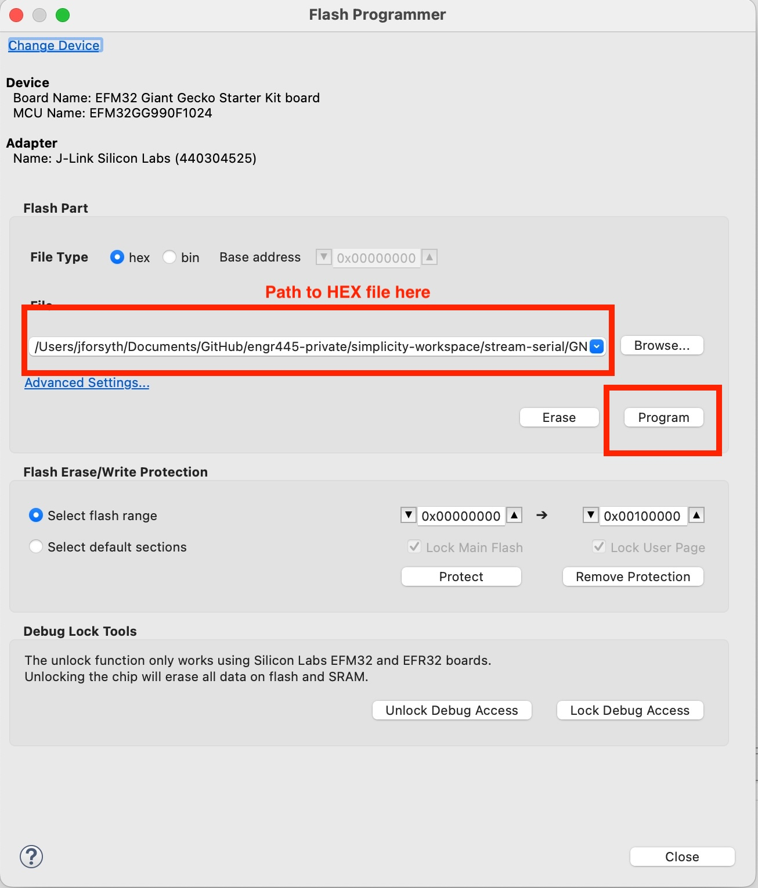

# Flashing the Firmware Binary

This document explains how to load (flash) the pre-compiled firmware binary to your EFM32GG board.

## What You Need

- Your EFM32GG development board connected to your computer via the debug adapter (J-Link)
- Simplicity Studio 5 installed
- The `.hex` firmware file provided by your instructor

## Steps to Flash the Firmware

### 1. **Open Simplicity Studio 5**

Launch Simplicity Studio 5 on your computer.

### 2. **Access the Flash Programmer Tool**

There are multiple ways to access the Flash Programmer:

**Option A: From the Tools Menu**
- Click the **Tools** button on the toolbar (wrench icon)
- Select **Flash Programmer**

**Option B: From a Project Context** (if you have a project open)
- Some perspectives have a dedicated **Flash Programmer** button on the toolbar

**Option C: From the Top Toolbar Icons**
- Look for the **Flash Programmer icon** in the icon bar at the top of Simplicity Studio
- 

---

### 3. **Select the Firmware Binary**

In the Flash Programmer window:

1. Click the **Browse...** button (or click in the file path field)
2. Navigate to the location where your instructor provided the `.hex` file
3. Select the `.hex` file
4. Click **Open**

The file type dropdown should automatically filter to show `.hex` and `.bin` files. If needed, change the filter to "Hex Files (*.hex)".

### 4. **Select Your Device** (if not already selected)

If you have multiple devices connected:

1. Click **Change Device**
2. Select your EFM32GG board from the list
3. Click **OK**

### 5. **Flash the Binary**

1. Verify that your board is **connected** to your computer
2. Click the **Program** button

You should see a progress indicator. Once complete, you'll see a confirmation message.

**Reference image of the Flash Programmer tool:**

### 6. **Verify Success**

If flashing was successful:
- The Flash Programmer will show a completion message
- Your board will be running the new firmware
- You can now stream data from the board (see the assignment instructions for details)

## Troubleshooting

### "Device Not Found" Error

- **Solution:** Ensure your board is connected via the J-Link debug adapter
- Check that the USB cable is firmly seated
- Try unplugging and re-plugging the cable
- In some cases, you may need to restart Simplicity Studio

### "Failed to Erase" or "Programming Failed"

- **Solution:** Try again, ensuring the board is powered and connected
- Click **Advanced Settings** to verify you're erasing only the main flash (not system areas)
- If the problem persists, try reflashing with a different cable or USB port

### File Not Found

- **Solution:** Verify the path to the `.hex` file is correct
- The file may have moved or the filename may have changed
- Ask your instructor to re-provide the file if needed

## After Flashing

Once the firmware is successfully loaded:

1. The board is now running the firmware
2. Proceed to the assignment instructions for how to read/stream the data
3. You can use a serial terminal (e.g., PuTTY, minicom, or VS Code serial monitor) to view data output

## Need Help?

If you encounter issues:

- Check that Simplicity Studio 5 is up to date
- Ensure your board's J-Link driver is installed (usually automatic with Simplicity Studio)
- Contact your instructor with details about the error message you see
